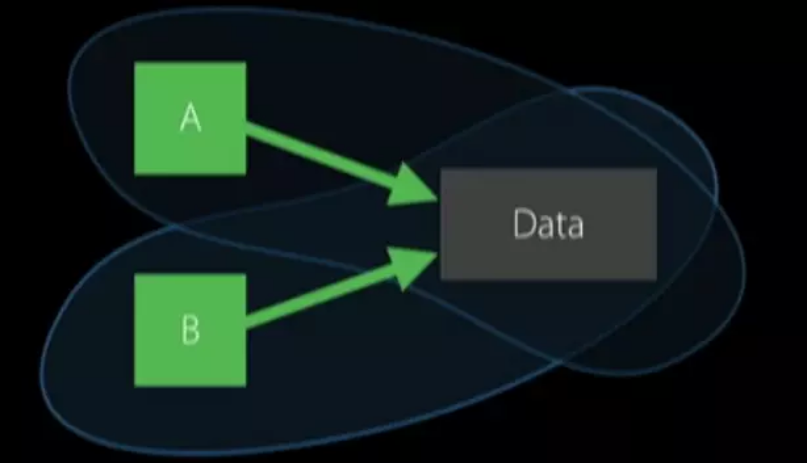
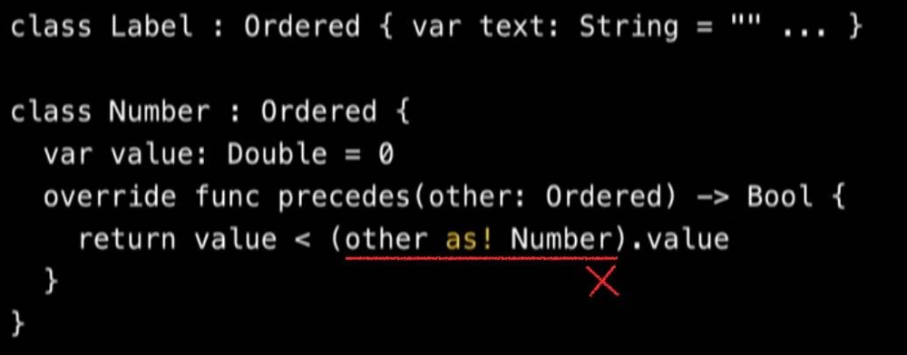
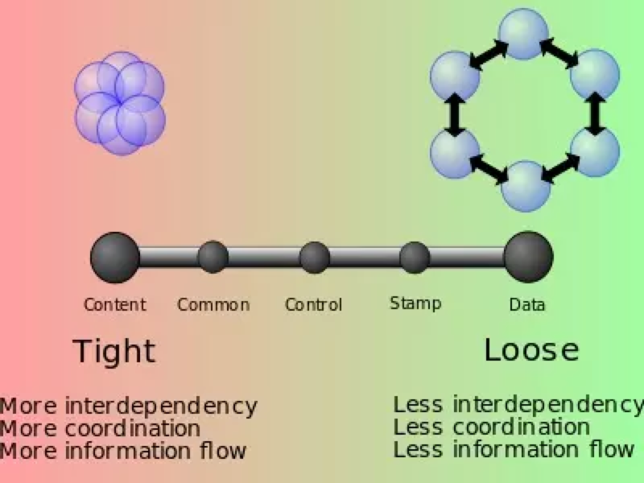
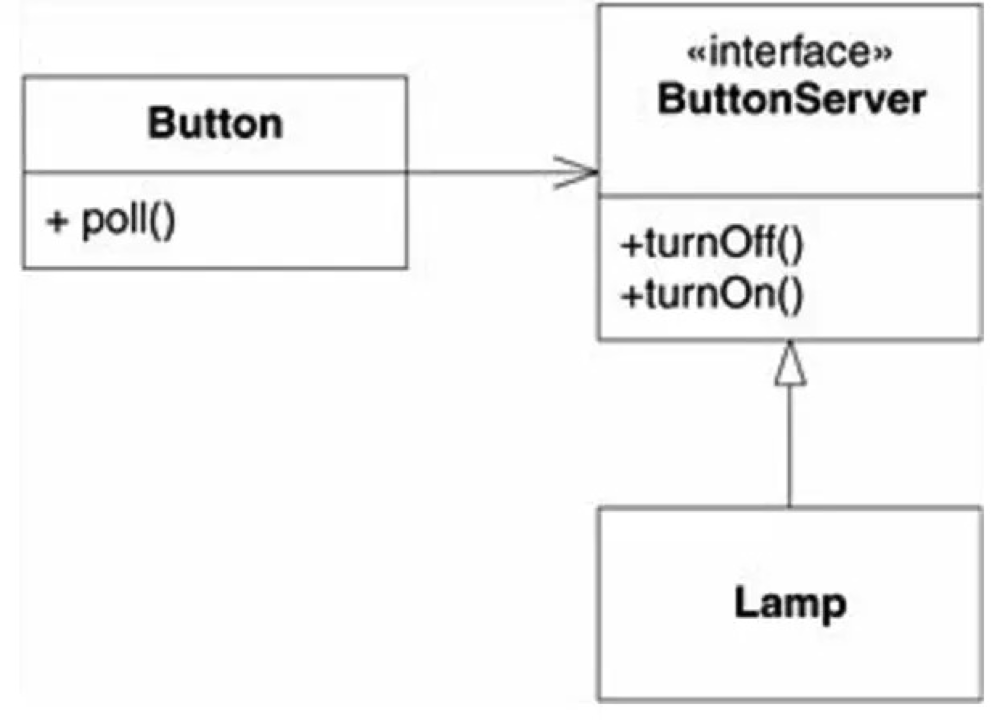

# Protocol

面向协议编程 \(Protocol Oriented Programming\) 是 Apple 在 2015 年 WWDC 上提出的 Swift 的一种编程范式。下面将从Protocol的基本用法开始讲起，最后再分析Protocol在降低代码耦合性方面的优势

### Protocol - 协议基本用法

> 《 The Swift Programming Language 》

**Protocol 基础语法**

1. 属性要求 ：
   * { get set } ：指定读写属性
   * static／class：指定类型属性
2. 方法要求：
   * static／class：指定类方法
   * mutating：要求实现可变方法（针对值类型的实例方法，可以在该方法中修改它所属的实例以及实例的任意属性的值）
3. 构造器要求：
   * 在遵循协议的类中，必须使用`required`关键字修饰，保证其子类也必须提供该构造器的实现。（除非有`final`修饰的类，可以不用`required`，因为不会再有子类）

**Protocol 作为类型**

1. 作为类型：代表遵循了该协议的某个实例（实际上就是某个实例遵循了协议）
2. 协议类型的集合：`let A: [someProtocol]`，遵守某个协议的实例的集合
3. Delegate 委托设计模式：定义协议来封装那些需要被委托的功能

**Protocol 间的关系**

1. 协议的继承：协议可继承
2. 协议的合成：使用`&`关键字，同时遵循多个协议
3. 协议的一致性：使用`is`、`as？`、`as！`进行一致性检查
4. 类专属协议：协议继承时使用`class`关键字，限制该协议职能被类继承

**optional & @objc 关键字**

可选协议：使用`optional`修饰属性、函数、协议本身，同时所有`option`必须被`@objc`修饰，协议本身也必须使用`@objc`，只能被Objective-C的类或者`@objc`的类使用

**extension 关键字**

* （对实例使用）令已有类型遵循某个协议
* （对协议使用）可遵循其他协议，增加协议一致性
* （对协议使用）提供默认实现
* （搭配`where`对协议使用）增加限制条件

### Classes 类 - 特点和问题

> 类（Class） 是面向对象编程之中的重要元素，它代表的是一个共享相同结构和行为的对象的集合

* Classes 可以做的事：
  * Encapsulation 封装：表现为对外提供接口，隐藏具体逻辑，保证类的高内聚
  * Access Control 访问控制：依赖于类的修饰符（如public、private），保证隔离性
  * Abstraction 抽象：提取具有类似特性的事物，进行建模
  * NameSpace 命名空间：避免不同作用域中，同名变量、函数发生冲突
  * Expressive Syntax 丰富的语法
  * Extensibility 可拓展性：可继承、可重写等等

#### Classes 的问题：

**1. Implicit Sharing 隐式共享:**



可能会导致大量保护性拷贝（Defensive Copy），导致效率降低；也有可能发生竞争条件（race condition），出现不可预知的错误；为了避免race condition，需要使用锁（Lock），但是这更会导致代码效率降低，并且有可能导致死锁（Dead Lock）

**2. Inheritance All 全部继承：**

由于继承时，子类将继承父类全部的属性，所以有可能导致子类过于庞大，逻辑过于复杂。尤其是当父类具有存储属性（stored properties）的时候，子类必须全部继承，并且小心翼翼得初始化，避免损坏父类中的逻辑。如果需要重写（override）父类的方法，则必须要小心思考如何重写以及何时重写。

**3. Lost Type Relationships 不能反应类型关系：**



上图中，两个类（Label、Number）拥有相同的父类（Ordered），但是在 Number 中调用 Order 类必须要使用强制解析（as！）来判断 Other 的属性，这样做既不优雅，也非常容易出Bug（如果 Other 碰巧为Label类）

### Coupling or dependency 耦合性

> 采用面向协议编程的方式，可以在一定程度上降低代码的耦合性。

耦合性是一种软件度量，是指一程序中，模块及模块之间信息或参数依赖的程度。高耦合性将使得维护成本变高，同时降低代码可复用程度。低耦合性是结构良好程序的特性，低耦合性程序的可读性及可维护性会比较好。

**耦合级别**



图示是耦合程度由高到低，可粗略分为五个级别：

* **Content coupling** 内容耦合：又称病态耦合，一个模块直接使用另一个模块的内部数据。
* **Common coupling** 公共耦合：又称全局耦合，指通过一个公共数据环境相互作用的那些模块间的耦合。公共耦合的复杂程序随耦合模块的个数增加而增加。
* **Control coupling** 控制耦合：指一个模块调用另一个模块时，传递的是控制变量（如开关、标志等），被调模块通过该控制变量的值有选择地执行块内某一功能。
* **Stamp coupling** 特征耦合/标记耦合：又称数据耦合，几个模块共享一个复杂的数据结构。
* **Data coupling** 数据耦合：是指模块借由传入值共享数据，每一个数据都是最基本的数据，而且只分享这些数据（例如传递一个整数给计算平方根的函数）

**高耦合性带来的问题**

* 维护代价大：修改一个模块时可能产生**涟漪效应**，其他模块的内部逻辑也需要修改
* 结构不清晰：由于模块间依赖性太多，所以在模块的组合时需要消耗更多精力
* 可复用性低：每一个模块的依赖模块太多，导致可复用的程度降低

**解耦 - Dependency Inversion Principle 依赖反转原则**

传统的依赖关系创建在高层次上，而具体的策略设置则应用在低层次的模块上，采用继承的方式实现。依赖反转原则（DIP）是指一种特定的解耦方式，使得高层次的模块不依赖于低层次的模块的实现细节，依赖关系被颠倒（反转），从而使得低层次模块依赖于高层次模块的需求抽象。

DIP 规定：

* 高层次的模块不应该依赖于低层次的模块，两者都应该依赖于抽象接口。
* 抽象接口不应该依赖于具体实现。而具体实现则应该依赖于抽象接口。

  




举一个简单而经典的例子 -- **台灯和按钮**。

第一幅图为传统的实现方式，依赖关系被创建直接在高层次对象（Button）上，当你需要改变低层次对象（Lamp）时，你必须要同时更改其父类（Button），如果此时有多个低层次的对象继承自父类（Button），那么更改其父类就变得十分困难。而第二幅图是符合DIP原则的方式，高层对象（Button）把需求抽象为一个抽象接口（ButtonServer），而具体实现（Lamp）依赖于这个抽象接口。同时，当需要实现多个底层对象时，只需要在具体实现时进行不同的实现即可。

**解耦 - Protocol Oriented Programming 面向协议编程**

面向协议编程中，Protocol 实际上就是 DIP 中的抽象接口。通过之前的讲解，采用面向协议的方式进行编程，即是对依赖反转原则 DIP 的践行，在一定程度上**降低代码的耦合性**，避免耦合性过高带来的问题。下面通过一个具体实例简单讲解一下：

首先是高层次结构的实现，创建EmmettBrown的类，然后声明了一个需求（travelInTime方法）。

```text
// 高层次实现 - EmmettBrown
final class EmmettBrown {
	private let timeMachine: TimeTraveling
	init(timeMachine: TimeTraveling) {
		self.timeMachine = timeMachine
	}
	func travelInTime(time: TimeInterval) -> String {
		return timeMachine.travelInTime(time: time)
	}
}
```

采用 Protocol 定义抽象接口 travelInTime，低层次的实现将需要依赖这个接口。

```text
// 抽象接口 - 时光旅行
protocol TimeTraveling {
    func travelInTime(time: TimeInterval) -> String
}
```

最后是低层次实现，创建DeLorean类，通过遵循TimeTraveling协议，完成TravelInTime抽象接口的具体实现。

```text
// 低层次实现 - DeLorean
final class DeLorean: TimeTraveling {
	func travelInTime(time: TimeInterval) -> String {
		return "Used Flux Capacitor and travelled in time by: \(time)s"
	}
}
```

使用的时候只需要创建相关类即可调用其方法。

```text
// 使用方式
let timeMachine = DeLorean()
let mastermind = EmmettBrown(timeMachine: timeMachine)
mastermind.travelInTime(time: -3600 * 8760)
```

### Delegate - 利用 Protocol 解耦

> Delegation is a design pattern that enables a class or structure to hand off \(or delegate\) some of its responsibilities to an instance of another type.

委托（Delegate）是一种设计模式，表示将一个对象的部分功能转交给另一个对象。委托模式可以用来响应特定的动作，或者接收外部数据源提供的数据，而无需关心外部数据源的类型。部分情况下，Delegate 比起自上而下的继承具有更松的耦合程度，有效的减少代码的复杂程度。

那么 Deleagte 和 Protocol 之间是什么关系呢？在 Swift 中，Delegate 就是基于 Protocol 实现的，定义 Protocol 来封装那些需要被委托的功能，这样就能确保遵循协议的类型能提供这些功能。

Protocol 是 Swift 的语言特性之一，而 Delegate 是利用了 Protocol 来达到解耦的目的。

**Delegate 使用实例：**

```text
//定义一个委托
protocol CustomButtonDelegate: AnyObject{
    func CustomButtonDidClick()
}
 
class ACustomButton: UIView {
    ...
    weak var delegate: ButtonDelegate?
    func didClick() {
        delegate?.CustomButtonDidClick()
    }
}

// 遵循委托的类
class ViewController: UIViewController, CustomButtonDelegate {
    let view = ACustomButton()
    override func viewDidLoad() {
        super.viewDidLoad()
        ...
        view.delegate = self
    }
    func CustomButtonDidClick() {
        print("Delegation works!")
    }
}
```

**代码说明**

如前所述，Delegate 的原理其实很简单。`ViewController` 会将 `ACustomButton` 的 `delegate` 设置为自己，同时自己遵循、实现了 `CustomButtonDelegate` 协议中的方法。这样在后者调用 `didClick` 方法的时候会调用 `CustomButtonDidClick` 方法，从而触发前者中对应的方法，从而打印出 Delegation works!

**循环引用**

我们注意到，在声明委托时，我们使用了 `weak` 关键字。目的是在于避免循环引用。`ViewController` 拥有 `view`，而 `view.delegate` 又强引用了 `ViewController`，如果不将其中一个强引用设置为弱引用，就会造成循环引用的问题。

**AnyObject**

定义委托时，我们让 protocol 继承自 `AnyObject`。这是由于，在 Swift 中，这表示这一个协议只能被应用于 class（而不是 struct 和 enum）。

实际上，如果让 protocol 不继承自任何东西，那也是可以的，这样定义的 Delegate 就可以被应用于 class 以及 struct、enum。由于 Delegate 代表的是遵循了该协议的实例，所以当 Delegate 被应用于 class 时，它就是 Reference type，需要考虑循环引用的问题，因此就必须要用 `weak` 关键字。

但是这样的问题在于，当 Delegate 被应用于 struct 和 enum 时，它是 Value type，不需要考虑循环引用的问题，也不能被使用 `weak` 关键字。所以当 Delegate 未限定只能用于 class，Xcode 就会对 weak 关键字报错：**'weak' may only be applied to class and class-bound protocol types**

那么为什么不使用 class 和 NSObjectProtocol，而要使用 AnyObject 呢？NSObjectProtocol 来自 Objective-C，在 pure Swift 的项目中并不推荐使用。class 和 AnyObject 并没有什么区别，在 Xcode 中也能达到相同的功能，但是官方还是推荐使用 AnyObject。

### 参考资料

* [WWDC - Protocol-Oriented Programming in Swift](https://developer.apple.com/videos/play/wwdc2015/408/)
* [Github - OOD-Principles-In-Swift](https://github.com/ochococo/OOD-Principles-In-Swift)
* [The Swift Programming Language - Protocol](https://developer.apple.com/library/content/documentation/Swift/Conceptual/Swift_Programming_Language/Protocols.html)

